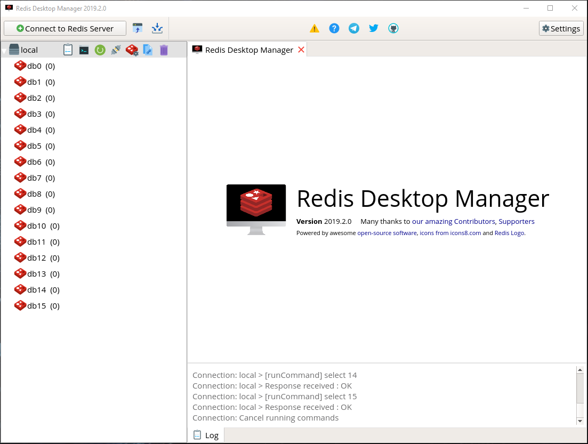

## Redis Desktop Manager 2019 on Windows



### Steps:
- Install [Docker](https://docs.docker.com/docker-for-windows/install/): 
- Install [VcXsrv Windows X Server](https://sourceforge.net/projects/vcxsrv/files/latest/download)
- Run `XLaunch` and follow the wizard. Make sure `Disable access control` is checked.
- Clone repo: `git clone https://github.com/nitzzzu/RedisDesktopManager.git`
- Build the docker image: `docker build -f Dockerfile.multistage -t rdm .`
- Get your `<ipaddress>`: `ipconfig`
- Run the container: `docker run --rm --network host -d --name rdm -v %cd%\data:/root/.rdm -e DISPLAY=<ipaddress>:0.0 rdm`

### Run on Linux

```
xhost +local:docker
docker run --rm --network host -d --name rdm -v $(pwd)/data:/root/.rdm -v /tmp/.X11-unix:/tmp/.X11-unix -e DISPLAY rdm
```